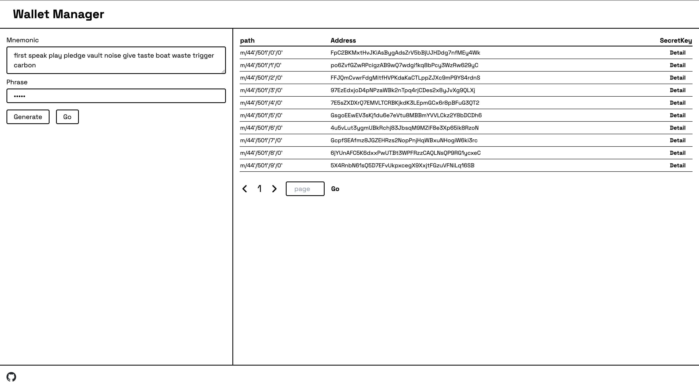

This is a solana wallet manager, inspired by https://iancoleman.io/bip39/.

这是一个solana的钱包管理器，源于https://iancoleman.io/bip39/。

## How to use

If you don't have a mnemonic phrase, click "generate" to create a new one. However, for security reasons, it's best not to use a standalone mnemonic; instead, combine it with a passphrase. After entering the passphrase, click "GO" to generate the encrypted account. Click "detail" to view the account's private key. Next time, when you input the same mnemonic and passphrase, you'll see the same account. When copying the account's private key, remember to split it into segments and copy them in a shuffled order to prevent malicious programs from monitoring your clipboard.

## 如何使用

如果你没有助记词，点击generate可以生成一个新的助记词。但为了安全起见，最好不要使用单独的助记词，请配合密码短语使用。当你输入密码短语后，点击GO，就会出现加密后的账号。点击detail可以看到账号的私钥。下次当你输入同样的助记词和同样的密码短语，就能看到同样的账号。复制账号私钥的时候，请切记分几段打乱顺序复制，以防止有恶意程序监听您的剪切板。
